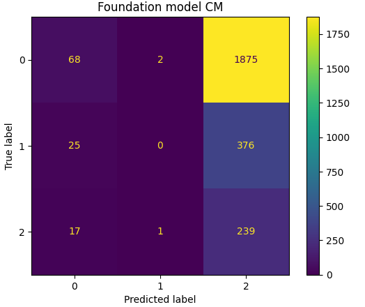

# Parameter Efficient Fine-Tuning (PEFT) of Foundation Models on Custom Dataset

This project is on Parameter Efficient Fine-Tuning (PEFT) of foundation models to improve the performance of the model 
to classify medical health advice. The idea is given a sequence or text, classify the sequence whether 
it is not advice, weak advice or strong adice. The problem was framed as a sequence classification. 
The medalpaca/medical_meadow_health_advice ([dataset](https://huggingface.co/datasets/medalpaca/medical_meadow_health_advice)) dataset in Hugging face was used to fine-tune the model and evaluate its performance performance.

- Model: GPT2 model was due to its small number of parameters, so that it will be easy to fine-tune it in smaller GPU memory available from Udacity workspace.

- Fine-tuning dataset: As described above the medalpaca/medical_meadow_health_advice dataset in Hugging face was used to fine-tune and evaluate the performance of the model. The dataset was split into training (60%) and test set (30%).

- PEFT technique: Low-Rank Adaptation (LoRA) in Hugging face was used to fine-tune the model on the task since it has reduced computational and memory requirements.

- Evaluation approach: both of the Foundation Model and the PEFT Model were evaluated on a separately held test data using accuracy and f1-score metrics. Confusion matrix was also plotted. Model performance is evaluated as follows:

  * Classification accuracy
  * Classification F1-score
  * Classification confusion matrix
  * Mis-classified sequences have been also explored

Classification confusion matrix of GPT semantic classification model before fine-tuning 

Classification confusion matrix of GPT semantic classification model after PEFT
